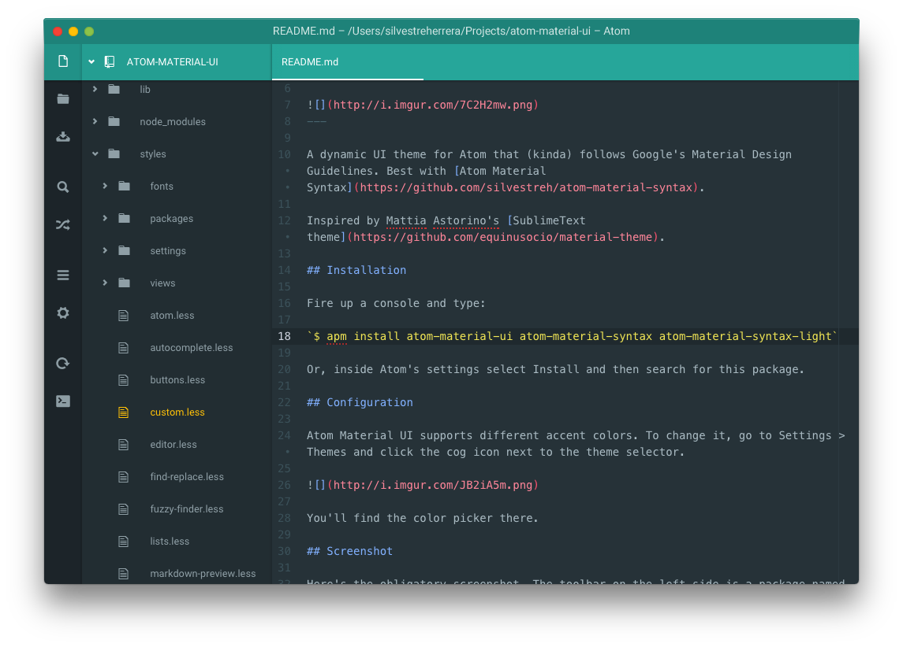
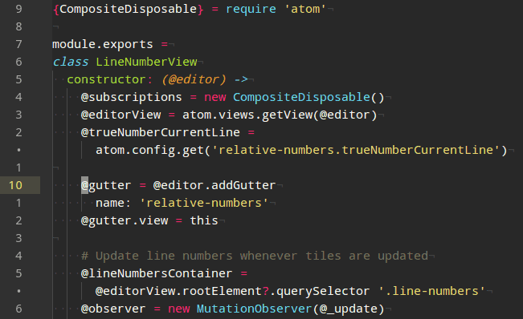
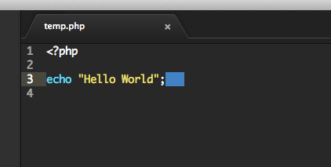
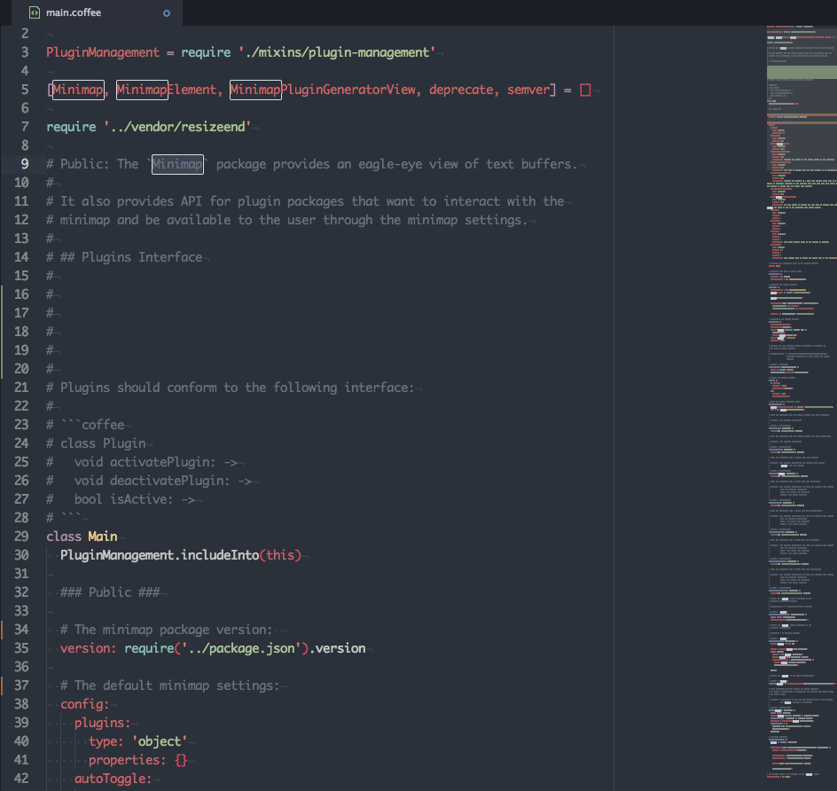
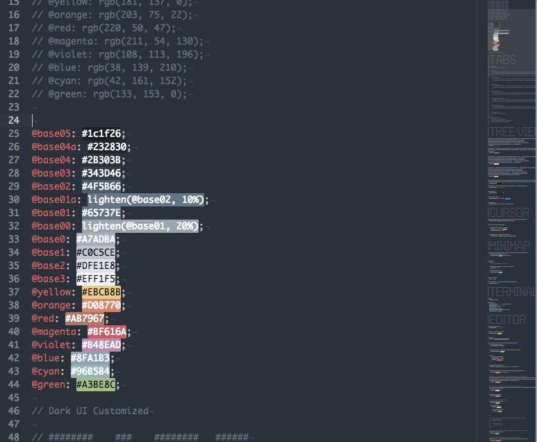
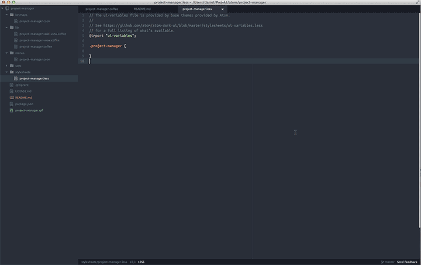
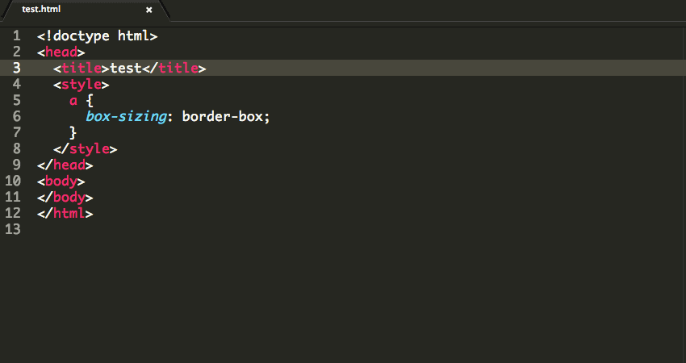
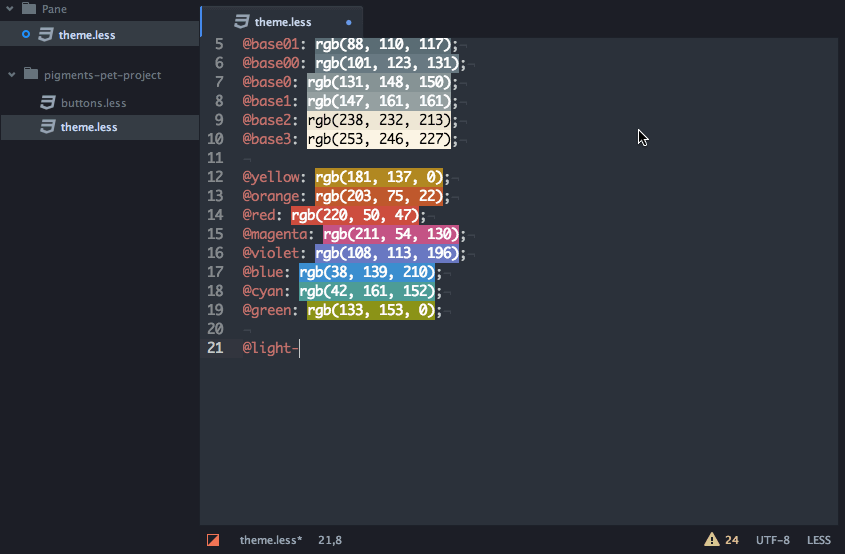

# Awesome Atom
一些有用的 Atom 插件

[English](README.md)

## 目录
* [主题](#Themes)
  * [atom-material-ui](#atom-material-ui)
* [通用](#Common)
  * [relative-numbers](#relative-numbers)
  * [trailing-spaces](#trailing-spaces)
  * [vim-mode](#vim-mode)
  * [ex-mode](#ex-mode)
  * [minimap](#minimap)
  * [minimap-pigments](#minimap-pigments)
  * [autocomplete-paths](#autocomplete-paths)
  * [atom-beautify](#atom-beautify)
  * [imdone-atom](#imdone-atom)
  * [Nuclide](#Nuclide)
  * [linter](#linter)
  * [highlight-selected](#highlight-selected)
  * [project-manager](#project-manager)
* [HTML](#HTML)
  * [emmet](#emmet)
  * [tag](#tag)
* [CSS](#CSS)
  * [color-picker](#color-picker)
  * [autoprefixer](#autoprefixer)
  * [pigments](#pigments)
  * [linter-scss-lint](#linter-scss-lint)
* [JavaScript](#JavaScript)
  * [linter-jshint](#linter-jshint)
  * [linter-eslint](#linter-eslint)
  * [hyperclick](#hyperclick)
  * [js-hyperclick](#js-hyperclick)
* [python](#python)
  * [autocomplete-python](#autocomplete-python)
  * [linter-flake8](#linter-flake8)
  * [python-tools](#python-tools)

##  主题
*  [atom-material-ui](https://atom.io/themes/atom-material-ui) - 遵循 Google Material Design 设计原则的主题

##  通用
*  [relative-numbers](https://atom.io/packages/relative-numbers) - 显示相对行号

*  [trailing-spaces](https://atom.io/packages/trailing-spaces) - 高亮多余的空格

*  [vim-mode](https://atom.io/packages/vim-mode) - vim 模式

*  [ex-mode](https://atom.io/packages/ex-mode) -  vim 模式的扩展

*  [minimap](https://atom.io/packages/minimap) - 完整代码的小地图预览

*  [minimap-pigments](https://atom.io/packages/minimap-pigments) - 在 [minimap](#minimap) 中展示 [pigments](#pigments) 颜色

*  [autocomplete-paths](https://atom.io/packages/autocomplete-paths) - 路径自动补全

*  [atom-beautify](https://atom.io/packages/atom-beautify) - 自动美化 HTML, CSS, JavaScript, PHP, Python, Ruby, Java, C, C++, C#, Objective-C, CoffeeScript, TypeScript, Coldfusion, SQL 等等

美化之前 | 美化之后
------|-----
原始 HTML | 美化的 HTML
 | 

*  [imdone-atom](https://atom.io/packages/imdone-atom) - 任务列表

*  [Nuclide](https://atom.io/packages/nuclide) - Nuclide 为 Atom 提供了非常多 IDE 的特性

*  [linter](https://atom.io/packages/linter) - 基础语法检查模块

*  [highlight-selected](https://atom.io/packages/highlight-selected) - 高亮选中的部分

*  [project-manager](https://atom.io/packages/project-manager) -  Atom 项目管理工具

##  HTML

*  [emmet](https://atom.io/packages/emmet) - HTML 标签自动补全

*  [tag](https://atom.io/packages/tag) - Sublime Text 风格的标签自动闭合

##  CSS

*  [color-picker](https://atom.io/packages/color-picker) - CSS 颜色选择器

*  [autoprefixer](https://atom.io/packages/autoprefixer) - 自动为 CSS 和 Sass 添加浏览器前缀

*  [pigments](https://atom.io/packages/pigments) - 在文件中展示颜色代码的颜色

*  [linter-scss-lint](https://atom.io/packages/linter-scss-lint) - Scss(Sass) 语法检查

##  JavaScript

*  [linter-jshint](https://atom.io/packages/linter-jshint) - JavaScript 语法检查，使用 jshint

*  [linter-eslint](https://atom.io/packages/linter-eslint) - JavaScript 语法检查，使用 ESLint

*  [hyperclick](https://atom.io/packages/hyperclick) - 可扩展的文本点击事件插件

*  [js-hyperclick](https://atom.io/packages/js-hyperclick) - 变量定义跳转

##  python

*  [autocomplete-python](https://atom.io/packages/autocomplete-python) - Python 包、变量、方法和函数的自动补全

*  [linter-flake8](https://atom.io/packages/linter-flake8) - python 语法检查，使用 flake8

*  [python-tools](https://atom.io/packages/python-tools) - 变量跳转、代码重构、变量重命名等工具

显示用法

跳转到定义处

选择整个字符串

