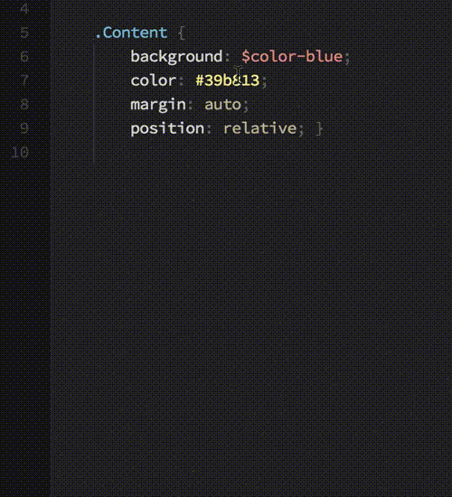

# Awesome Atom
Some useful Atom packages

[中文](README-cn.md)

## Table of Content
* [Themes](#Themes)
  * [atom-material-ui](#atom-material-ui)
* [Common](#Common)
  * [relative-numbers](#relative-numbers)
  * [trailing-spaces](#trailing-spaces)
  * [vim-mode](#vim-mode)
  * [ex-mode](#ex-mode)
  * [minimap](#minimap)
  * [minimap-pigments](#minimap-pigments)
  * [autocomplete-paths](#autocomplete-paths)
  * [atom-beautify](#atom-beautify)
  * [imdone-atom](#imdone-atom)
  * [Nuclide](#Nuclide)
  * [linter](#linter)
  * [highlight-selected](#highlight-selected)
  * [project-manager](#project-manager)
  * [file-icons](#file-icons)
* [HTML](#HTML)
  * [emmet](#emmet)
  * [tag](#tag)
* [CSS](#CSS)
  * [color-picker](#color-picker)
  * [autoprefixer](#autoprefixer)
  * [pigments](#pigments)
  * [linter-scss-lint](#linter-scss-lint)
* [JavaScript](#JavaScript)
  * [linter-jshint](#linter-jshint)
  * [linter-eslint](#linter-eslint)
  * [hyperclick](#hyperclick)
  * [js-hyperclick](#js-hyperclick)
  * [language-babel](#language-babel)
* [python](#python)
  * [autocomplete-python](#autocomplete-python)
  * [linter-flake8](#linter-flake8)
  * [python-tools](#python-tools)

##  Themes
*  [atom-material-ui](https://atom.io/themes/atom-material-ui) - A dark UI theme for Atom that follows Google's Material Design Guidelines

##  Common
*  [relative-numbers](https://atom.io/packages/relative-numbers) - Relative line numbers for Atom

*  [trailing-spaces](https://atom.io/packages/trailing-spaces) - Highlights trailing whitespace

*  [vim-mode](https://atom.io/packages/vim-mode) - Add vim modal control

*  [ex-mode](https://atom.io/packages/ex-mode) - Ex for Atom's vim-mode

*  [minimap](https://atom.io/packages/minimap) - A preview of the full source code

*  [minimap-pigments](https://atom.io/packages/minimap-pigments) - An Atom plugin to display [pigments](#pigments) colors in the [Minimap](#minimap)

*  [autocomplete-paths](https://atom.io/packages/autocomplete-paths) - Adds path autocompletion to autocomplete+

*  [atom-beautify](https://atom.io/packages/atom-beautify) - Beautify HTML, CSS, JavaScript, PHP, Python, Ruby, Java, C, C++, C#, Objective-C, CoffeeScript, TypeScript, Coldfusion, SQL, and more in Atom

Before | After
------|-----
Original HTML | Beautified HTML
 | 

*  [imdone-atom](https://atom.io/packages/imdone-atom) - A hackable task-board for TODOs, FIXMEs, HACKs, etc in your code

*  [Nuclide](https://atom.io/packages/nuclide) - A unified developer experience for web and mobile development, built as a suite of features on top of Atom to provide hackability and the support of an active community

*  [linter](https://atom.io/packages/linter) - A Base Linter with Cow Powers

*  [highlight-selected](https://atom.io/packages/highlight-selected) - Highlights the current word selected when double clicking

*  [project-manager](https://atom.io/packages/project-manager) - Project Manager for easy access and switching between projects in Atom

*  [file-icons](https://atom.io/packages/file-icons) - Assign file extension icons and colours for improved visual grepping

##  HTML

*  [emmet](https://atom.io/packages/emmet) - the essential tool for web developers

*  [tag](https://atom.io/packages/tag) - Sublime Text-inspired HTML & XML Tag menu and functions. Close Tag (⌥⌘.)

##  CSS

*  [color-picker](https://atom.io/packages/color-picker) - Right click or press CMD-SHIFT-C/CTRL-ALT-C to open it

*  [autoprefixer](https://atom.io/packages/autoprefixer) - Prefix CSS and SCSS

*  [pigments](https://atom.io/packages/pigments) - A package to display colors in project and files

*  [linter-scss-lint](https://atom.io/packages/linter-scss-lint) - Lint SCSS on the fly, using scss-lint

##  JavaScript

*  [linter-jshint](https://atom.io/packages/linter-jshint) - Linter plugin for JavaScript, using jshint

*  [linter-eslint](https://atom.io/packages/linter-eslint) - Lint JavaScript on the fly, using ESLint

*  [hyperclick](https://atom.io/packages/hyperclick) - Pluggable text-clicking UI for Atom

*  [js-hyperclick](https://atom.io/packages/js-hyperclick) - A hyperclick provider that lets you jump to where variables are defined

*  [language-babel](https://atom.io/packages/language-babel) - Babel JavaScript ES201x, React JSX & Flow Grammar & Transpiler

##  python

*  [autocomplete-python](https://atom.io/packages/autocomplete-python) - Python packages, variables, methods and functions with their arguments autocompletion powered by Jedi

*  [linter-flake8](https://atom.io/packages/linter-flake8) - Atom linter plugin for Python, using flake8

*  [python-tools](https://atom.io/packages/python-tools) - Goto definition, show usages, refactor/rename and more for python files

Show Usages

Goto Definition

Select String Contents

